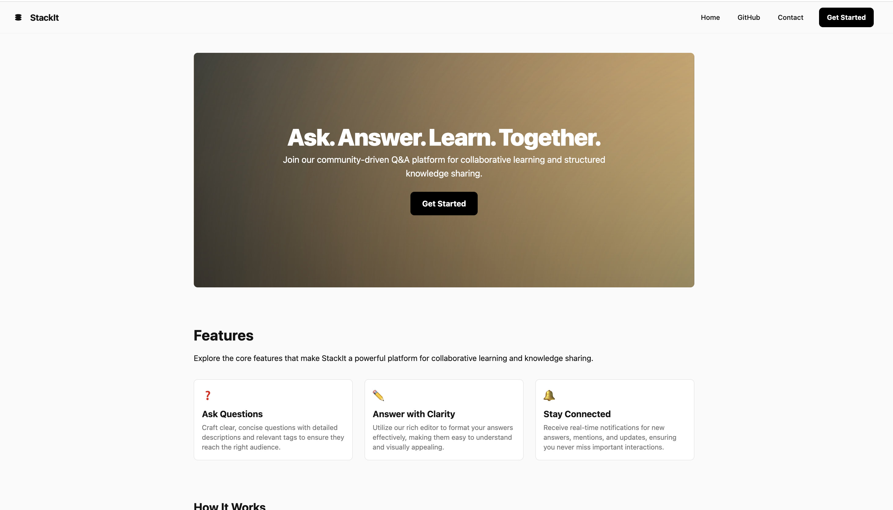
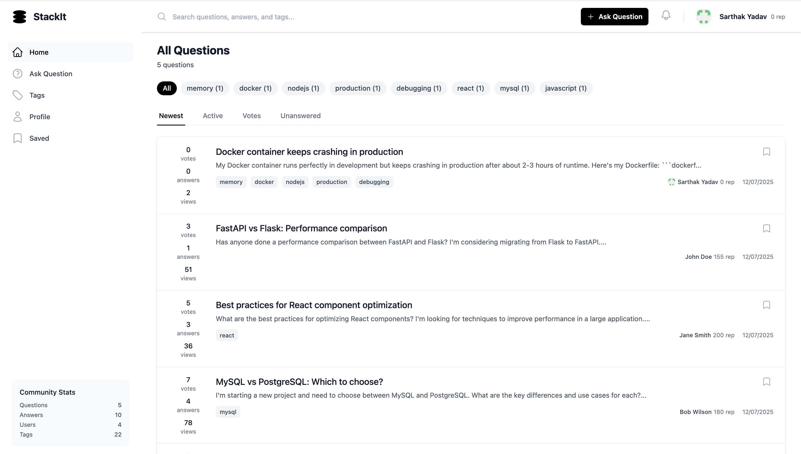
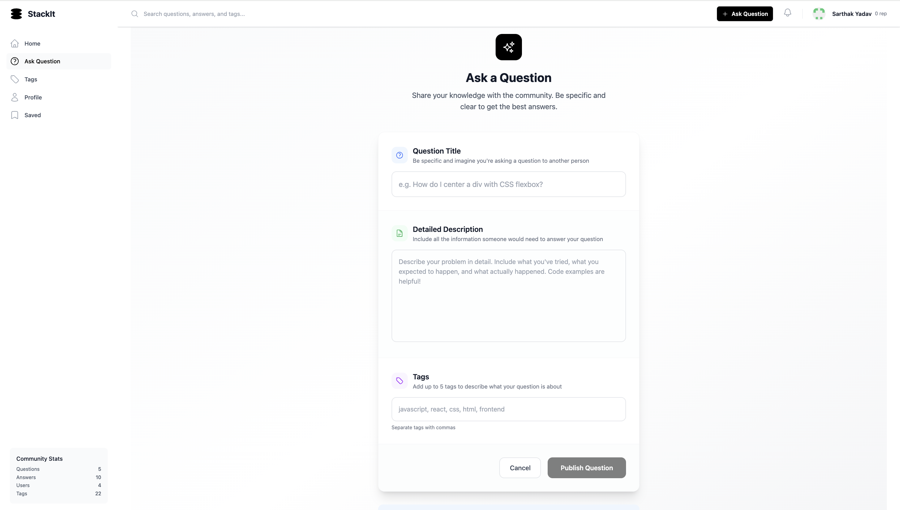
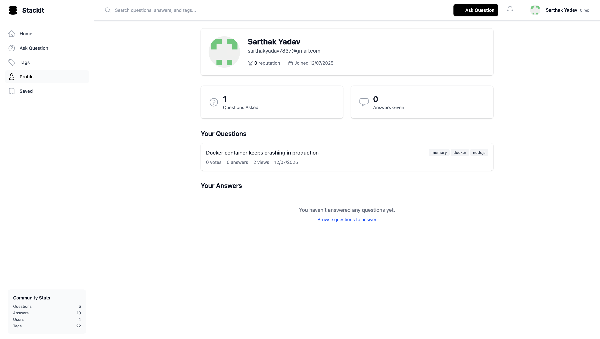

# StackIt - Q&A Forum Platform

A modern Q&A forum platform built with React and FastAPI, featuring Clerk authentication, real-time voting, and comprehensive question management.

## 📸 Screenshots

### Landing Page

*Clean and modern landing page with gradient hero section and feature highlights*

### Questions Dashboard(Home Page)

*Main dashboard showing all questions with tag filtering, sorting options, and community stats*

### Ask Question

*Intuitive question creation form with rich text editor and tag management*

### Tags Overview

*Comprehensive tags system showing all available tags with question counts*

### Profile Overview

*Personalized user profile showing questions asked, reputation score, and activity summary with clean statistics display*

## 🚀 Features

- **Authentication**: Secure user authentication with Clerk
- **Question Management**: Create, edit, delete, and vote on questions
- **Answer System**: Comprehensive answer system with voting and acceptance
- **Tag System**: Organize questions with tags
- **Real-time Updates**: Live voting and interaction updates
- **User Profiles**: Complete user profile management
- **Search & Filter**: Advanced search and filtering capabilities
- **Responsive Design**: Mobile-first responsive design with Tailwind CSS

## 🛠️ Tech Stack

### Frontend
- **React 19** - UI framework
- **Vite 7** - Build tool and dev server
- **Tailwind CSS 4** - Styling
- **React Router 7** - Client-side routing
- **Clerk** - Authentication
- **Heroicons** - Icons

### Backend
- **FastAPI** - Python web framework
- **SQLAlchemy** - ORM
- **MySQL** - Database (Railway hosted)
- **Clerk** - Authentication integration
- **Pydantic** - Data validation
- **Uvicorn** - ASGI server

## 📋 Prerequisites

Before running the application, ensure you have:

- **Node.js** (v18 or higher)
- **Python** (v3.8 or higher)
- **pip** (Python package manager)
- **Clerk Account** (for authentication)

## 🔧 Installation & Setup

### 1. Clone the Repository

```bash
git clone <your-repo-url>
cd StackIt
```

### 2. Backend Setup

```bash
# Navigate to backend directory
cd backend

# Create virtual environment (recommended)
python -m venv myenv

# Activate virtual environment
# On macOS/Linux:
source myenv/bin/activate
# On Windows:
myenv\Scripts\activate

# Install dependencies
pip install -r requirements.txt

# Create environment file
touch .env
```

Add the following to your `.env` file:
```env
# Database
DATABASE_URL=" "

# Clerk Authentication
CLERK_SECRET_KEY=your_clerk_secret_key_here
CLERK_PUBLISHABLE_KEY=your_clerk_publishable_key_here
```

### 3. Frontend Setup

```bash
# Navigate to frontend directory (from root)
cd frontend

# Install dependencies
npm install

# Create environment file
touch .env.local
```

Add the following to your `.env.local` file:
```env
VITE_CLERK_PUBLISHABLE_KEY=your_clerk_publishable_key_here
```

### 4. Clerk Configuration

1. **Create Clerk Account**: Go to [clerk.com](https://clerk.com) and create an account
2. **Create Application**: Set up a new application in Clerk dashboard
3. **Configure Sign-in Methods**: Enable email, Google, GitHub, or other providers
4. **Get API Keys**: 
   - Copy the **Publishable Key** (starts with `pk_test_...`)
   - Copy the **Secret Key** (starts with `sk_test_...`)
5. **Update Environment Files**: Add the keys to your `.env` and `.env.local` files

## 🚀 Running the Application

### Start Backend Server

```bash
# From backend directory
cd backend

# Activate virtual environment if not already active
source myenv/bin/activate  # macOS/Linux
# or
myenv\Scripts\activate     # Windows

# Start the server
python run.py
```

The backend will be available at: `http://localhost:8000`

### Start Frontend Development Server

```bash
# From frontend directory (new terminal)
cd frontend

# Start the development server
npm run dev
```

The frontend will be available at: `http://localhost:5173`

## 🔗 API Documentation

Once the backend is running, you can access:

- **Interactive API Docs**: `http://localhost:8000/docs`
- **Alternative API Docs**: `http://localhost:8000/redoc`
- **Health Check**: `http://localhost:8000/health`

## 📱 Application Flow

### For New Users

1. **Landing Page**: Visit `http://localhost:5173`
2. **Sign Up**: Click "Get Started" to create an account
3. **Browse Questions**: View questions as a guest
4. **Ask Questions**: Sign in to ask questions
5. **Vote & Answer**: Participate in the community

### For Authenticated Users

1. **Dashboard**: Access full features at `http://localhost:5173/app`
2. **Ask Questions**: Create new questions with tags
3. **Vote**: Upvote/downvote questions and answers
4. **Answer**: Provide answers to questions
5. **Profile**: Manage your profile and view your activity

## 🗂️ Project Structure

```